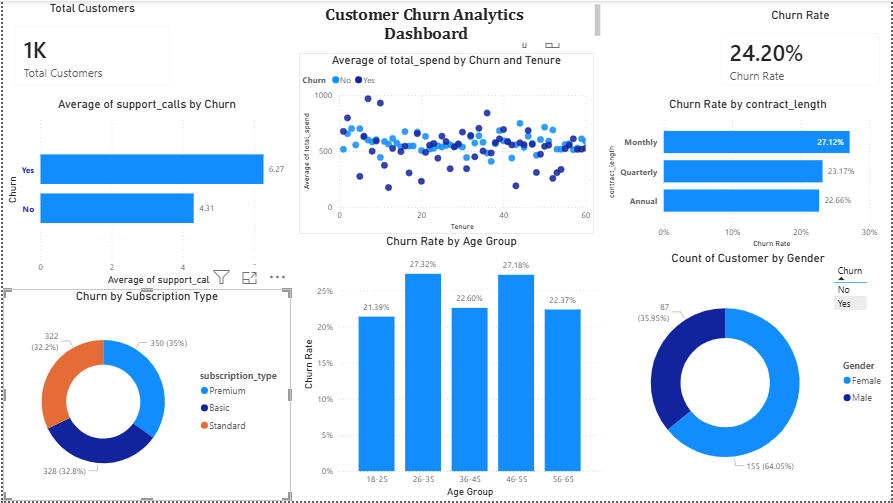

# analysis_using_SQL_customer_churn

"24% of our customers are leaving, which is almost 1 in 4 people. 
Customers on monthly contracts leave the most (27%), so we should offer/push them towards annual plans. 
People who call support more often tend to leave. Young customers (18-35) churn the most, so we need better engagement strategies for them. 
High-spending Premium customers are also leaving, which is most dangerous as this group brings in the most revenue.

